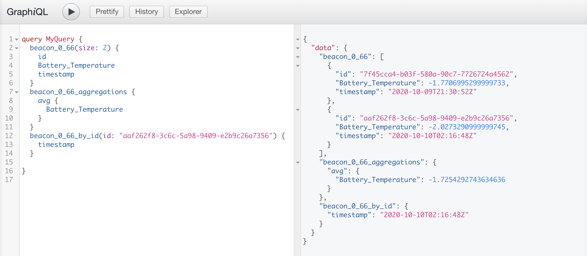

# Sturgeon :fish:

[](https://hub.docker.com/repository/docker/mewil/sturgeon)

Dynamic GraphQL API for [Elasticsearch](https://elastic.co/).



Sturgeon dynamically creates GraphQL schemas and resolvers for each index in an Elasticsearch cluster.
It currently provides schemas for querying documents by ID, a list of documents, and several simple aggregations.
More complex arguments and search options will be available soon. 

## Docker Quickstart

With Elasticsearch running on your local machine on port `9200`, run the following `docker run` command to start Sturgeon on
port `8080`. 
```shell script
docker run -e ELASTICSEARCH_HOSTS=host.docker.internal:9200 -p 8080:8080 --rm mewil/sturgeon:latest 
```
After the server is running, use a tool such as [GraphiQL](https://github.com/graphql/graphiql) to explore the generated schema.

## Options

Sturgeon can be configured using the following environment variables:

| Variable                              | Description                                                                                        | Default |
| ------------------------------------- | -------------------------------------------------------------------------------------------------- | ------- |
| `ELASTICSEARCH_HOSTS`                 | A comma-separated list of Elasticsearch hosts                                                      | None    |
| `ELASTICSEARCH_INDEX_INCLUDE_PATTERN` | A regular expression that determine which Elasticsearch indices are used to create GraphQL schemas | `".*"`  |
| `ENABLE_AGGREGATIONS`                 | Used to enable or disable aggregation schemas                                                      | `true`  |


_Disclaimer:_ Sturgeon is actively under development and may not behave as expected.